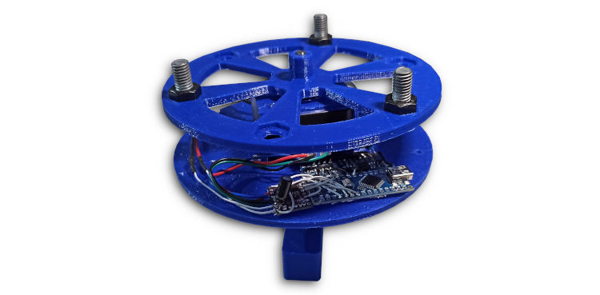

# Reaction Wheel model

This repository contains the files (code and STL) to build a reaction wheel controlled satellite model.

This project is described in this article (including test results): https://charleslabs.fr/en/project-Reaction+Wheel+Attitude+Control

## Material

There are 4 parts to 3D-print: base, satellite disk, motor holder and flywheel. The only part requiring support is the motor holder.

Additionnal hardware is required:

| Quantity  | Item                       |
|----------------|-----------------------|
| 1 | NEMA 17 (23&nbsp;mm or 40&nbsp;mm length) |
| 2 | 608 bearing                        |
| 1 | M8 threaded rod (65&nbsp;mm)       |
| 4 | M8 nut                             |
| 8 | M3&times;6&nbsp;mm screw           |
| 4 | M3 nut                             |
| 1 | Arduino Nano board                 |
| 1 | DRV8825 driver module              |
| 1 | Level shifter module               |
| 1 | MPU6050 sensor module              |
| 1 | 100&nbsp;µF 16&nbsp;V capacitor    |
| 1 | 2S LiPo Battery (300&nbsp;mAh)     |

Additionnal M8 hardware is required to tune the moment of inertia of the wheel. In my case, I used 3 M8&times;20&nbsp;mm bolts and 3 M8 nuts.

See the article for more detailed build instructions.

## License

This model is released under the terms of the MIT License.